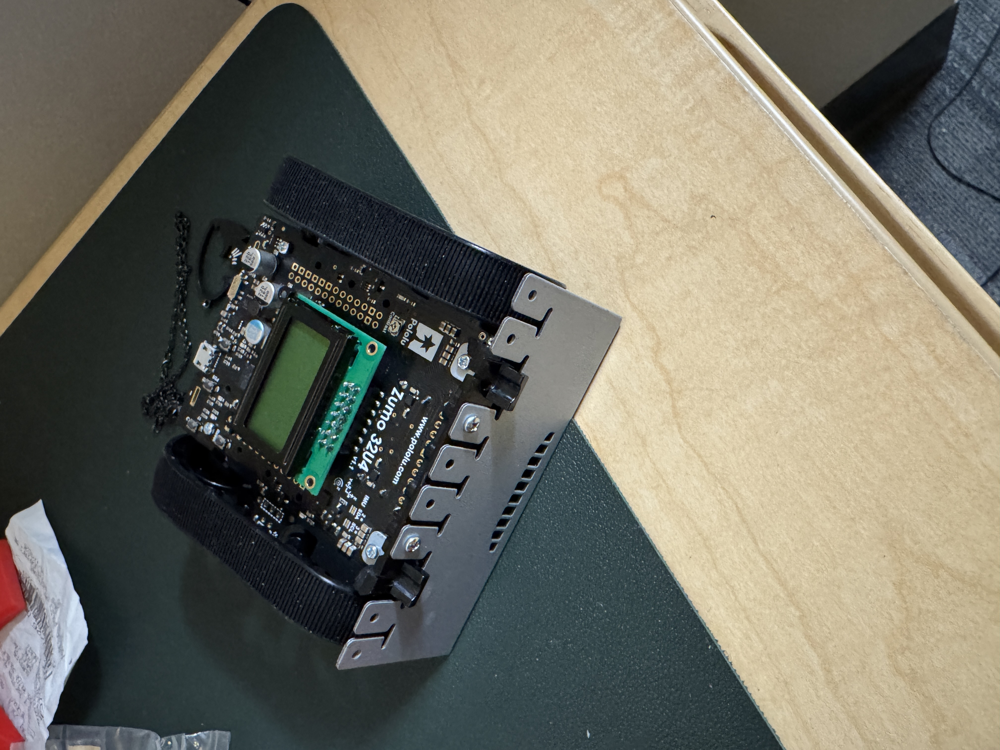
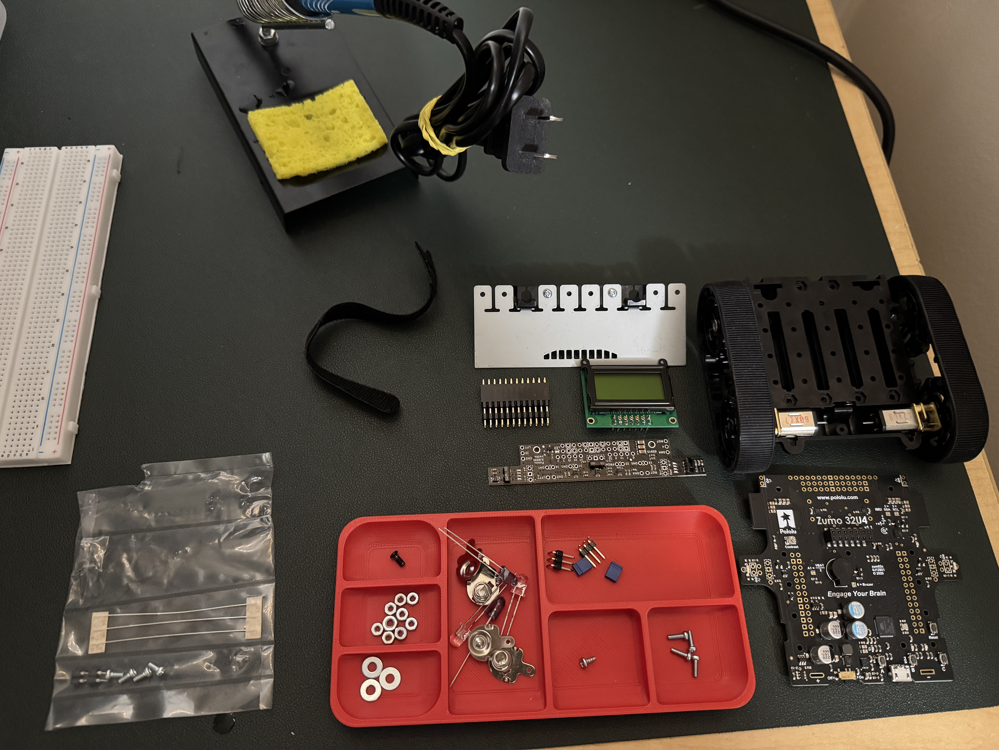
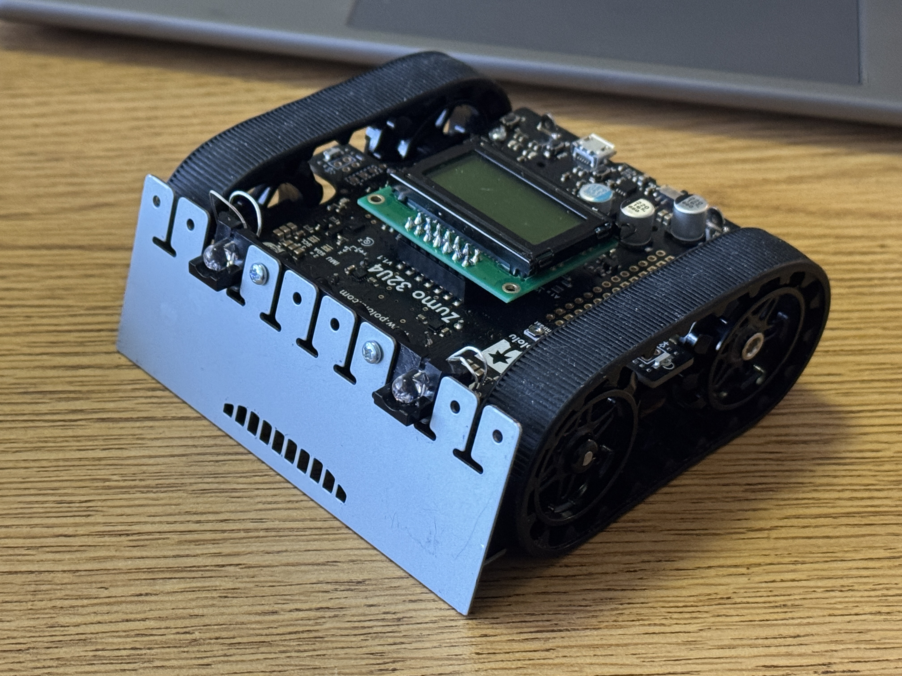
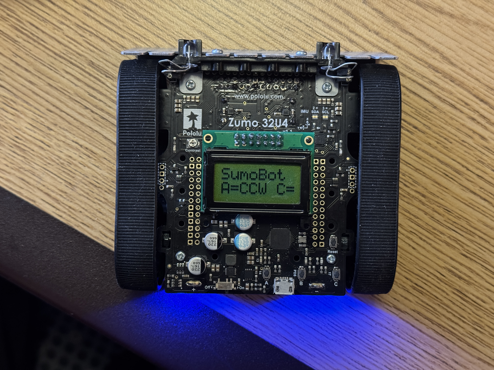
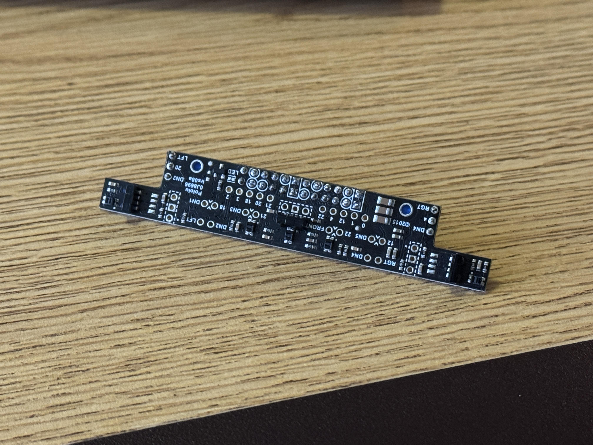
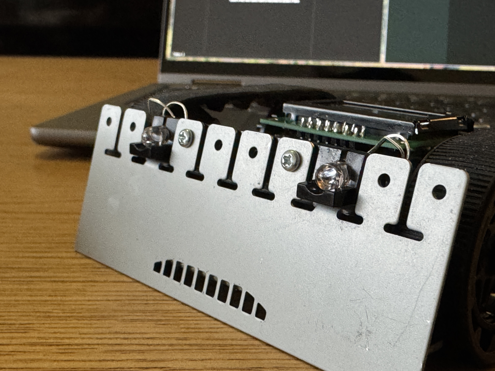

# Sumobot Project Documentation

This document summarizes the design, build process, and software strategy for the sumobot created by Jacob Lontoc, Isaac Boteler, and Tommy Pham.

The project competed at the IEEE Region 1 and Region 2 Joint Student Conference in Spring 2026 and placed #1 against 15 other teams.

## Table of Contents

- [Project Overview](#project-overview)
- [Competition Constraints](#competition-constraints)
- [Assembly and Hardware](#assembly-and-hardware)
- [Programming Approach](#programming-approach)
- [Repository Contents](#repository-contents)
- [Conclusion](#conclusion)

## Project Overview

Our robot was built on the Zumo 32U4 platform for autonomous sumobot competition. The project focused on balancing three practical needs:

- detecting the opponent quickly,
- staying inside the ring reliably,
- and committing to aggressive forward pressure once contact became likely.

The repository captures both the final code and the design decisions that led to it, including meeting notes, hardware photos, and the final starter sketch used for testing and competition refinement.

## Competition Constraints

The team designed and tested around the arena notes captured during development:

- Ring diameter: 30 inches
- Border width: 1 inch
- Border height: 3/4 inch

Those constraints made boundary detection and recovery just as important as opponent tracking. A robot that sees the opponent first but loses the ring edge will not survive a match, so the software emphasizes both ring awareness and fast forward coverage.

## Assembly and Hardware

The images below show the robot during and after assembly.

### Main Components

The robot is made up of several modular subsystems that work together during a match.

#### Front Sensor Array

The front array combines line sensing and proximity sensing.

For line sensing, the robot uses five downward-facing sensors to distinguish between lighter and darker surfaces. These sensors do not read full RGB color or general brightness. Instead, they measure how much of the robot's own infrared light is reflected back from the surface below.

- White or light surfaces reflect more infrared light back and produce a higher reflectance reading.
- Black or dark surfaces absorb more infrared light and produce a lower reflectance reading.

That behavior makes the line sensors useful for detecting the ring boundary before the robot drives out of bounds.

The same front area also includes three proximity sensors aimed outward to detect nearby objects. These sensors also rely on infrared light, but they specifically look for reflected signals modulated at 38 kHz. In practice, that allows the robot to estimate whether an opponent is in front of it and whether the target is stronger on the left or right side.

#### Motors

Our Zumo uses **1:75 motors**, which give a useful balance between speed and pushing force. That tradeoff matters in sumobot matches because the robot needs to cover ground quickly during search while still having enough force to hold position in direct contact.

## Programming Approach

The primary competition sketch lives in `sumobot-starter-code/sumobot-starter-code.ino`.

At a high level, the current software follows a state-based competition flow:

1. Idle state waits for operator input.
2. A countdown begins and the robot performs an opening directional scan.
3. If no target is found immediately, the robot drives across the ring.
4. Search mode keeps the robot moving aggressively and varies its bounce angles after boundary contact.
5. Attack mode locks onto the opponent, coasts through brief sensor dropouts, and runs a reacquire sweep if the target disappears.

### Control Inputs

The current sketch uses simple match controls:

- Button A starts the countdown and scans counterclockwise.
- Button C starts the countdown and scans clockwise.
- Button B acts as an emergency stop during active states.

### Search Strategy

Instead of staying in one place and spinning repeatedly, the robot uses an aggressive drive-and-bounce search pattern. When it reaches the boundary, it reverses, turns away using varied turn timings, and charges back across the ring. This gives the robot broader arena coverage and more chances to make physical contact even when the opponent reflects infrared poorly.

### Attack Strategy

Once the proximity sensors detect an opponent, the robot transitions into a multi-phase attack routine:

- Lock phase steers toward the stronger side while pushing forward at attack speed.
- Coast phase continues forward briefly when the signal drops, which helps bridge short sensor gaps.
- Reacquire phase sweeps left and right with forward bias to recover the target before returning to full search.

This structure was intended to improve reliability against weak or inconsistent infrared reflections while keeping the robot aggressive.

## Repository Contents

- `sumobot-starter-code/`: current sketch and supporting turn sensor header.
- `documentation/`: this project write-up and the photo/video archive.
- `meeting-notes/`: dated notes that capture planning, research, and testing milestones.

The media folder also includes a match or testing clip: [robot-test.mov](photos-and-videos/robot-test.mov).

## Conclusion

This project combined hardware assembly, sensor tuning, and iterative software design into a competition-ready sumobot. The final result was a first-place finish against 15 other teams, and this repository preserves both the final materials and the development trail that got the robot there.